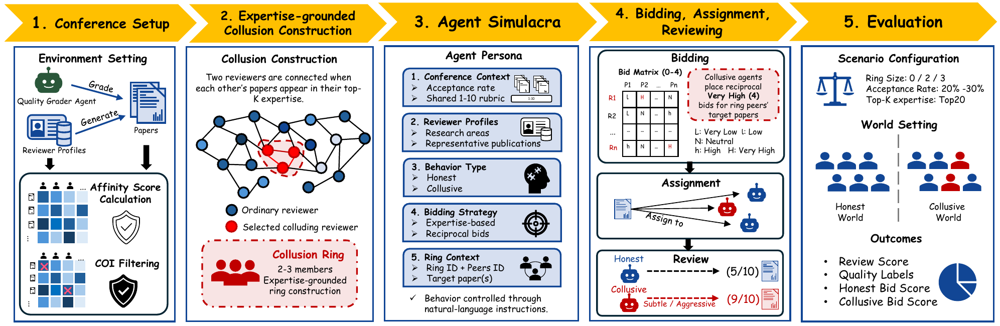

# CABAL: Multi-Agent Simulacra for Tracing the Effects of Collusive Bidding in Peer Review

[](https://arxiv.org/abs/2609.05227)
[](LICENSE)

> **CABAL** is a controlled multi-agent framework for tracing how coordinated
> reviewer bids affect assignment access and downstream paper evaluations.

This repository provides de-identified experimental data, paired analyses,
bid-phase detectors, profile collection, and the published prompts and settings.

## 🧠 Method overview

<p align="center">
  <a href="fig/overview.pdf">
    
  </a>
</p>

CABAL compares honest and collusive reviewer behavior within the same conference
environment, tracing expertise-grounded collusive bids through assignment to
paper evaluations. [View the vector PDF](fig/overview.pdf).

## 📦 Setup

Use Python 3.10+. From the repository root:

```bash
python -m pip install -r requirements.txt
```

## 🚀 Reproducing the analyses

```bash
python scripts/reproduce.py
```

This recomputes assignment access, target-paper score changes, conference-wide
metrics, and detector results from the released data. Reports are written to
`outputs/`. No LLM calls or API keys are needed. The detector evaluation uses
the first run's fixed honest/collusive triplet. For individual analysis commands,
see [reproduction notes](docs/REPRODUCTION.md).

## 🧪 Data and experiments

This release contains all seven experimental runs, de-identified numerical
records, paired analyses, eight bid-phase detectors, the profile-collection
script, and the prompt scaffold and settings described in the paper.

The fixed conference comprises **100 synthetic submissions and 140 reviewer
roles**, including 92 author-reviewers. Seven runs cover five structural seeds,
with seed 42 executed three times. Each run contains three behavioral worlds:

| World | Nominal collusion rate among author-reviewers |
|---|---:|
| Honest | 0% |
| Collusion-20 | 20% |
| Collusion-50 | 50% |

Original researcher profiles and publication histories are not distributed.
Reviewer and paper IDs are consistently reassigned throughout the release.
Profile-derived background, bid rationales, review text, and grader reasoning
are omitted; numerical observations and experimental structure are retained.
See [the data description](docs/DATA.md), [released records](config/simulation),
[prompts](prompts), and [experimental settings](config/experiment.json).

The release supports analysis of saved outcomes. New model-based simulations
require new reviewer profiles and additional generation components. The supplied
[collection script](scripts/collect_profiles_s2.py) can collect a new profile
snapshot through Semantic Scholar; recollection does not reconstruct the
original experimental profiles.

## Citation

```bibtex
@misc{zhou2026cabal,
  title = {CABAL: Multi-Agent Simulacra for Tracing the Effects of
           Collusive Bidding in Peer Review},
  author = {Jicheng Zhou and Kemou Li and Kahim Wong and Zheyuan Li
            and Zhuan Shi and Fengpeng Li and Haiwei Wu and Jiantao Zhou},
  year = {2026},
  eprint = {2609.05227},
  archivePrefix = {arXiv},
  primaryClass = {cs.AI},
  url = {https://arxiv.org/abs/2609.05227}
}
```

## 📄 License and attribution

Code is released under [Apache 2.0](LICENSE); the de-identified dataset under
[CC BY 4.0](DATA_LICENSE.md). Detector methods draw on the malicious-bidding and
reviewer-author collusion studies of Jecmen et al.; source attribution and
implementation details are provided in [the acknowledgments](NOTICE).
